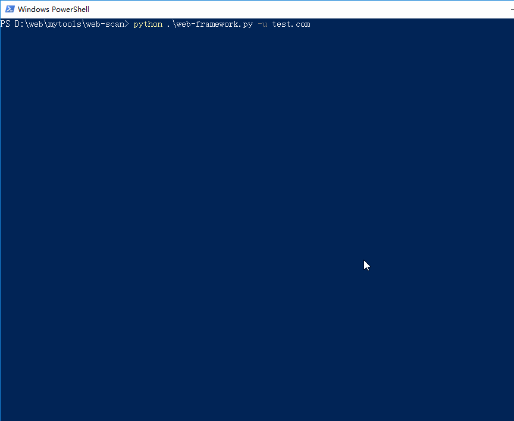

# Web-Scan

web扫描工具，目前支持的模块，以后学了什么新东西也对其进行更新

- jboss
  - CVE-2017-7504（/jbossmq-httpil/HTTPServerILServlet/页面反序列化）
  - CVE-2017-12149（/invoker/readonly/页面反序列化）
  - JMXInvokerServlet 反序列化
- tomcat
  - CVE-2017-12615（put上传文件）
  - weakpasswd（manager页面弱口令爆破）
- weblogic
  - CVE-2017-10271（/wls-wsat/CoordinatorPortType反序列化）
  - CVE-2018-2628（T3反序列化）
  - ssrf（/uddiexplorer/SearchPublicRegistries.jsp页面ssrf）
  - weakpasswd（console页面弱口令爆破）
- tools
  - backfile（网站备份文件扫描）
  - unauthorized（服务器未授权端口扫描，目前支持MySQL ，Ftp，Redis，MongoDB，Memcached，Jenkins，Elasticsearch，Hadoop （50070），Hadoop（8088-RCE），CouchDB ，Docker-Api,Zookeeper )
- cms
  - phpcms2008 （phpcms2008 type.php远程命令执行）

# USE

使用前在`lib/config`中添加自己的ceye.io地址，默认命令执行方式为`ping 靶机url.ceye.io地址`，方便批量利用时知道是那台服务器成功执行了shell。

使用方式，支持字典扫描，支持ip段扫描（适用于内网扫描）或ip解析：

1：字典扫描，字典文件在`data\url_dict`目录下。（本来是想写一个先子域名爆破，在进行扫描的以后再加上吧

` python .\web-framework.py -u test.com`



2：IP扫描

`python .\web-framework.py -p 192.168.57.135-192.168.57.136`

`python .\web-framework.py -p 172.16.10.0/24`


可以命令执行的漏洞可以在ceye.io看到回显，无法直接收到回显的漏洞，脚本显示存在需要进行手动利用。一些利用的方法写在script文件下对应的POC中了。

# ENV

version: python3

# 自定义POC

如果需要自己添加模块的化，再script模块下创建一个文件夹，然后在里面放xxxx.py，xxx.py形如：

```python
import lib.config.config as config
from lib.core.monitor import port_monitor,page_monitor

def poc(url): #传入的参赛为访问的url
    poc_type = 'weblogic:2017-10271'  #该poc的类型
    ports = ['80','7001']  #需要访问的端口
    port_info = {}  #用于保存返回的信息

    port_info,ports = port_monitor(url, poc_type, ports)   #对端口进行过滤，如果端口没开就不进行访问
    
    for port in ports:
        try:
            执行poc
        	如果poc执行成功
            port_info[port] = [1,poc_type,成功的信息]  #1代表成功，将单一端口的结果保存在port_info中
        except: #基本上就是执行失败了
            port_info[port] = [0,poc_type,'Conect failed'] #0代表失败
    
	return port_info
```

在`\lib\core\monitor.py`定义了几个过滤器，主要是检测发送poc时端口是否开放，以及需要访问的url是否存在。具体的可以看`\core\monitor.py`。